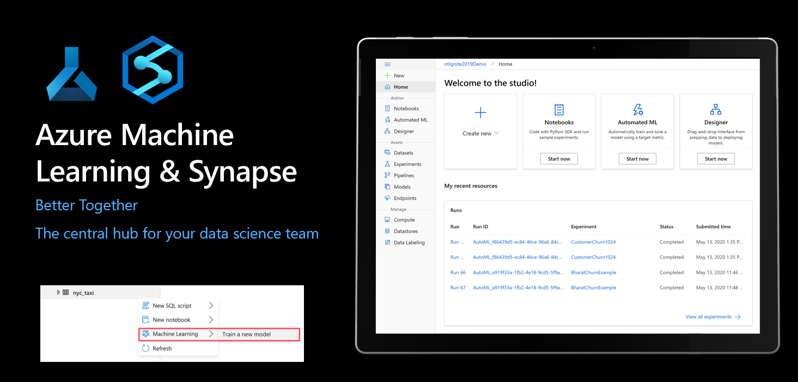
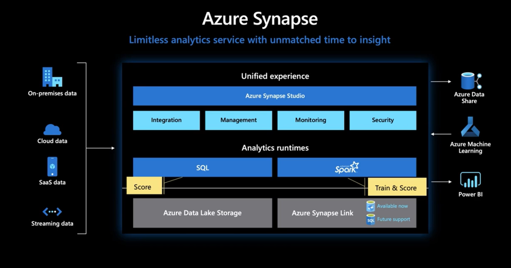
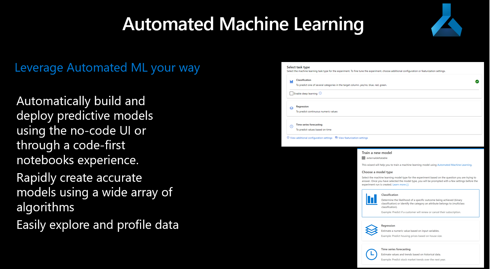

code-a-thon
===========

intro-into-leveraging-aml

Leveraging Synapse, we can actually do our training and scoring directly in the
Synapse workspace, but the objective of the code-a-thon is provide experience
with both the Synapse Spark pools, and the Azure ML environment.

Datasets can be retrieved from your storage account and made accessible in your
Azure ML workspace where you can leverage the familiar surroundings of a jupyter
notebook, or jupyter lab.

The following notebooks are about getting comfortable in the AML workspace
environment.

About this Repository:
----------------------

Data can be found in the data folder, these sample notebooks are working with
parquet files with Azure ML.

-   [001_model_train_notebook.ipynb](001_model_train_notebook.ipynb) - Training
    a basic model with no AML

-   [002_local_model_train_with_aml.ipynb](002_local_model_train_with_aml.ipynb)
    - Training a basic model leveraging an AML experiment

-   [003_compute_cluster_train.ipynb](003_compute_cluster_train.ipynb) -
    Training a model leveraging AML Computer Cluster

-   [004_inference_pipeline-parquet.ipynb](004_inference_pipeline-parquet.ipynb)
    - Training a model leveraing AML Compute Cluster

-   [005 Consume Rest Point to Populate a
    Datset.ipynb](005%20Consume%20Rest%20Point%20to%20Populate%20a%20Datset.ipynb)-
    Training a model leveraing AML Compute Cluster
    
-   [RegisterAMLDatasetinSynapse.ipynb](RegisterAMLDatasetinSynapse.ipynb)-
    Register a Dataset from within Synapse via Linked Service to AML
    

Great Resources
---------------

<https://github.com/MicrosoftLearning/mslearn-dp100>

<https://github.com/Azure-Samples/Synapse/tree/main/Notebooks/PySpark>

<https://docs.microsoft.com/en-us/azure/machine-learning/concept-optimize-data-processing>
<https://medium.com/distributed-computing-with-ray/how-to-speed-up-pandas-with-modin-84aa6a87bcdb>
<https://modin.readthedocs.io/en/latest/>
